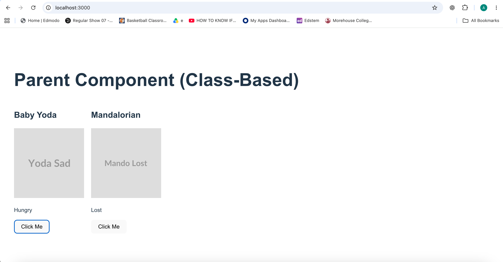
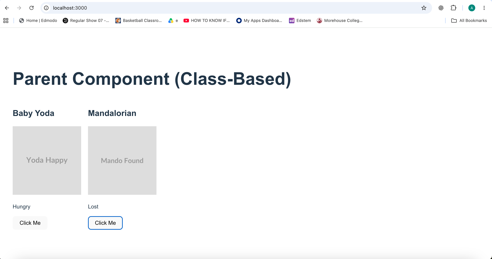

# Pet Kennel 
A react app that displays pet cards. There are two pets. When you click on the button below each pet, it should cycle between two different pictures for each pet. 
Built with class-based React components to practice state, props, and callbacks

## Installation 
1. Fork this repository, then clone your fork:
   git clone <your-fork-url>
2. Move into the project folder:
   cd petKennel
3. Make sure Docker Desktop is running, then build and start the app:
   docker compose up --build
4. Open http://localhost:3000 in your browser.
 
 Note: "The provided Dockerfile pinned Node 18, but Vite 7 requires Node 20+. I updated the base image to node:22-alpine." Either works; the second version reads more like documentation and less like a memo to yourself.

## Usage 
Each card shows a pet; the button cycles its images

## Screenshot 
Before clicking:

After clicking Baby Yoda's button - the image cycles:

## Technologies 
React 19, Vite 7, JavaScript (JSX), Docker, Node 22

## License 
MIT
